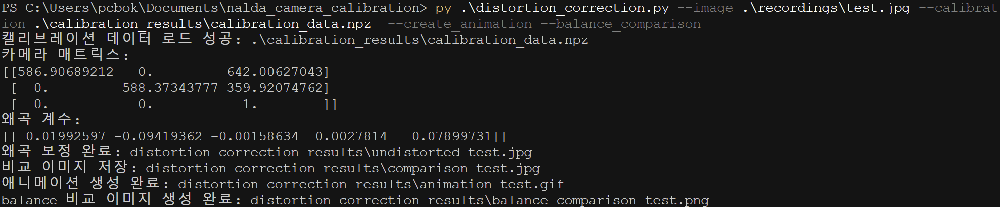

# NALDA 카메라 캘리브레이션

체스보드 패턴을 활용한 카메라 캘리브레이션 및 렌즈 왜곡 보정 도구


## 개요

이 프로젝트는 체스보드 패턴을 이용하여 카메라 캘리브레이션을 수행하고, 이를 통해 렌즈 왜곡을 보정하는 도구입니다. 사용자 친화적인 GUI를 통해 다양한 입력 소스(이미지 파일, 폴더, 비디오, 웹캠)에서 이미지를 선택하여 캘리브레이션을 수행할 수 있습니다.

## 주요 기능

1. **카메라 캘리브레이션 (camera_calibration.py)**
   - 체스보드 패턴이 포함된 이미지나 비디오를 분석하여 카메라 파라미터 계산
   - GUI 인터페이스를 통한 다양한 입력 소스 선택
     - 개별 이미지 파일 선택
     - 이미지 폴더 선택
     - 비디오 파일 또는 카메라 스트림 선택
   - 비디오에서 체스보드 프레임 선택 기능
     - 스페이스바로 일시정지/재생 전환
     - 코너 검출 실시간 확인 (C 키)
     - 선택한 프레임 자동 저장
   - 완전한 한글 지원 GUI 인터페이스
   - 코너 검출 결과 시각화 및 저장
   - 캘리브레이션 결과 및 재투영 오차 계산
   - 결과 파일 자동 생성 (.npz, .txt)

2. **렌즈 왜곡 보정 (distortion_correction.py)**
   - 계산된 카메라 파라미터를 이용한 이미지/비디오 왜곡 보정
   - 다양한 입력 형식 지원
     - 단일 이미지 보정
     - 여러 이미지 일괄 처리
     - 이미지 폴더 일괄 처리
     - 비디오 파일 처리
   - balance 파라미터를 통한 왜곡 보정 강도 조절 (0.0~1.0)
   - 시각화 기능
     - 원본과 보정된 이미지 비교 이미지 자동 생성
     - 원본/보정 이미지 간 전환 애니메이션 생성
     - 다양한 balance 값에 대한 비교 이미지 생성

## 요구 사항

- Python 3.6 이상
- OpenCV 4.x
- NumPy
- Matplotlib
- PIL (Pillow)

## 설치 방법

1. 저장소 클론:
   ```bash
   git clone https://github.com/yourusername/nalda_camera_calibration.git
   cd nalda_camera_calibration
   ```

2. 필요한 패키지 설치:
   ```bash
   pip install opencv-python numpy matplotlib pillow
   ```

## 사용 방법

### 1. 체스보드 패턴 준비

A4 용지에 체스보드 패턴을 출력하세요. 아래 링크에서 다양한 체스보드 패턴을 다운로드할 수 있습니다:
- [체스보드 컬렉션](https://markhedleyjones.com/projects/calibration-checkerboard-collection)

기본적으로 10x7 내부 코너를 가진 체스보드 패턴을 사용하지만, 명령줄 옵션을 통해 다른 크기도 지정 가능합니다.

### 2. 체스보드 패턴 촬영

다양한 각도와 거리에서 체스보드 패턴을 촬영합니다. 좋은 캘리브레이션 결과를 위해서는 최소 5장 이상의 다양한 각도에서 촬영된 이미지가 권장됩니다.

### 3. 카메라 캘리브레이션 수행

**GUI 모드로 실행:**
```bash
python camera_calibration.py --gui
```

GUI 모드에서는 다음과 같은 옵션을 선택할 수 있습니다:
1. 개별 이미지 파일 선택
2. 이미지 폴더 선택
3. 비디오 파일 또는 카메라 선택

**비디오에서 직접 프레임 선택:**
비디오 사용 시 다음 키를 활용하여 체스보드 이미지를 선택할 수 있습니다:
- 스페이스바: 일시정지/재생 전환
- C: 코너 검출 확인 (일시정지 상태에서)
- 엔터: 현재 프레임 선택 (일시정지 상태에서)
- 오른쪽 화살표: 다음 프레임으로 이동 (일시정지 상태에서)
- ESC: 종료

**비디오 파일을 사용한 캘리브레이션:**
```bash
python camera_calibration.py --video 체스보드_비디오.mp4
```

**이미지 디렉토리를 사용한 캘리브레이션:**
```bash
python camera_calibration.py --image_dir 체스보드_이미지_폴더
```

**체스보드 패턴 크기 지정:**
```bash
python camera_calibration.py --gui --chessboard_size 10 7 --square_size 2.5
```

### 4. 렌즈 왜곡 보정

캘리브레이션 후에는 다음 명령어로 이미지나 비디오의 왜곡을 보정할 수 있습니다:

**단일 이미지 보정:**
```bash
python distortion_correction.py --image 왜곡된_이미지.jpg --calibration calibration_results/calibration_data.npz
```

**여러 이미지 일괄 보정:**
```bash
python distortion_correction.py --images 이미지1.jpg 이미지2.jpg 이미지3.jpg --calibration calibration_results/calibration_data.npz
```

**이미지 폴더 일괄 보정:**
```bash
python distortion_correction.py --image_dir 이미지_폴더 --calibration calibration_results/calibration_data.npz
```

**비디오 보정:**
```bash
python distortion_correction.py --video 왜곡된_비디오.mp4 --calibration calibration_results/calibration_data.npz
```

**balance 파라미터 조절:**
```bash
python distortion_correction.py --image 왜곡된_이미지.jpg --calibration calibration_results/calibration_data.npz --balance 0.5
```

**추가 시각화 옵션:**
```bash
python distortion_correction.py --image 왜곡된_이미지.jpg --calibration calibration_results/calibration_data.npz --create_animation --balance_comparison
```

## 캘리브레이션 결과

카메라 캘리브레이션 결과는 `calibration_results` 디렉토리에 저장됩니다:
- `calibration_data.npz`: 캘리브레이션 매트릭스와 왜곡 계수 (OpenCV에서 사용 가능)
- `calibration_results.txt`: 사람이 읽을 수 있는 형태의 결과
- `detected_corners/`: 체스보드 코너 검출 결과 이미지
- `undistorted_images/`: 캘리브레이션으로 보정된 이미지 샘플

### 카메라 내부 파라미터 (Camera Matrix)
```
[[fx 0  cx]
 [0  fy cy]
 [0  0  1 ]]
```

예:
```
[[586.91 0      642.01]
 [0      588.37 359.92]
 [0      0      1     ]]
```

여기서:
- fx, fy: 카메라의 초점 거리 (픽셀 단위)
- cx, cy: 이미지 중심점 (주점, principal point)

### 왜곡 계수 (Distortion Coefficients)
```
[k1, k2, p1, p2, k3]
```

예:
```
[0.0199, -0.0942, -0.0016, 0.0028, 0.0790]
```

여기서:
- k1, k2, k3: 방사형 왜곡 계수
- p1, p2: 접선 왜곡 계수

## 렌즈 왜곡 보정 결과

렌즈 왜곡 보정 결과는 `distortion_correction_results` 디렉토리에 저장됩니다:
- `undistorted_*.jpg`: 왜곡 보정된 이미지
- `comparison_*.jpg`: 원본과 보정된 이미지 비교
- `animation_*.gif`: 원본과 보정된 이미지 간 전환 애니메이션 (요청 시)
- `balance_comparison_*.png`: 다양한 balance 값에 대한 비교 이미지 (요청 시)


# 프로그램 동작 사진

